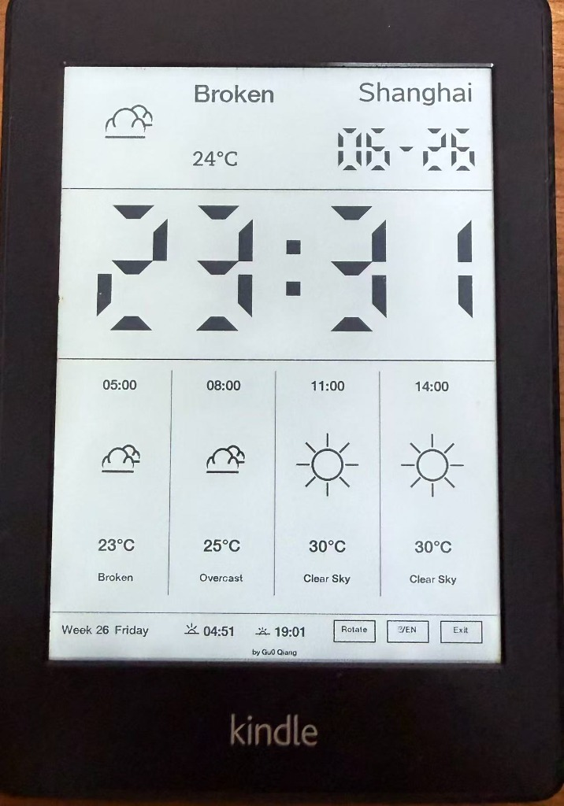
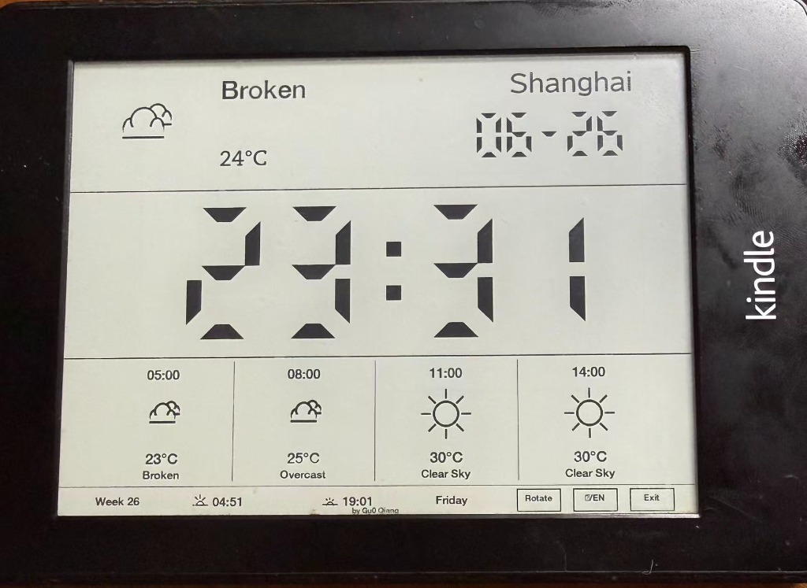

# Kindle 电子墨水屏天气时钟看板

本项目将一部已越狱的 Amazon Kindle 变成一个低功耗、独立的桌面天气时钟看板。使用 Python Pillow (PIL) 图形库进行画面绘制，生成高对比度、适合电子墨水屏的画面，包含 LCD 3D 拟真 7 段数码管时钟、极简天气矢量图标以及详细的天气实况与预报。

看板提供了底部状态栏触摸控制按钮，支持即时旋转屏幕方向、切换中英文显示以及退出看板回到 Kindle 原生系统。

---

## 演示效果

| 竖屏模式 (默认) | 横屏模式 |
|---|---|
|  |  |

---

## 功能特性

- **横竖切换**：支持**竖屏**（758x1024，默认）与**横屏**（1024x758，顺时针旋转90度以适配 Kindle 的竖屏硬件缓冲区）即时切换。
- **中英双语**：状态栏一键切换显示语言（星期、日期、天气描述以及按钮文本）。
- **极简 7 段数码管时钟**：通过数学几何绘制数码管段，无需依赖外部字体文件即可渲染出清晰厚重的 LCD 效果。
- **心跳冒号**：时间冒号每展现 7 秒，消失 3 秒，循环往复，防止画面过于呆板。
- **极简天气图标**：纯矢量绘制天气、日出、日落图标，完美融入 E-ink 墨水屏。
- **低功耗常亮**：支持保持设备唤醒进行每分钟/每秒动态局部刷新，背景灯处于设定状态。
- **自动退出**：插上 USB 充电或连接电脑时，看板守护进程会自动检测并干净地退出，恢复 Kindle 原生 GUI 系统。
- **缓存机制**：天气预报数据本地缓存 10 分钟，旋转屏幕与切换语言在 1 秒内即时响应，不消耗网络流量和 API 额度。
- **作者署名**：在状态栏底部居中渲染小字署名 `" by Gu0 Qiang"`。

---

## 硬件与软件要求

1. **已越狱的 Kindle**：带有触摸屏的 Kindle 设备（如 Paperwhite 2/3/4、Voyage、Oasis 等）。
2. **KUAL (Kindle Unified Application Launcher)**：用于启动脚本插件。
3. **Python 3.9+ 运行环境**：Kindle 上需安装 `/mnt/us/python3`（包含 `Pillow` 库的越狱包）。
4. **无线网络**：配置好 Kindle 连接到本地 Wi-Fi 以前往 OpenWeatherMap API 获取数据。

---

## 文件目录结构

```text
weather-station/
├── config.xml         # KUAL 插件配置文件
├── menu.json          # KUAL 启动菜单
├── weather.sh         # 主守护进程脚本（电源管理与循环控制）
├── render.py          # Python Pillow 图形渲染脚本
├── monitor_touch.py   # 触摸屏输入解码与按钮监听脚本
└── images/            # 屏幕截图和演示媒体文件
```

---

## 配置与部署

1. **获取 OpenWeatherMap API Key**：前往 [OpenWeatherMap](https://openweathermap.org/) 注册免费账户并获取 API Key。
2. **配置参数**：
   打开并编辑 `weather.sh`：
   ```bash
   API_KEY="您的_OPENWEATHERMAP_API_KEY"
   CITY_NAME="Shanghai,CN"  # 您的城市代码
   INTERVAL=600             # 默认天气数据拉取间隔（10分钟）
   ```
3. **拷贝至 Kindle**：
   - 将 Kindle 通过 USB 连接至电脑。
   - 将 `weather-station` 整个文件夹拷贝到 Kindle 根目录下的 `extensions` 目录中：
     `[Kindle 根目录]/extensions/weather-station/`
   - **非常重要**：请确保所有文件（尤其是 `weather.sh` 脚本和 python 文件）都使用 **Unix (LF)** 换行符。Windows 上的 CRLF 换行符会导致 Kindle shell 报错。

---

## 使用说明

1. 安全弹出 Kindle 并拔掉 USB 数据线。
2. 启动 Kindle 上的 **KUAL**。
3. 点击 **Weather Station** -> **Start Weather Station**。
4. 看板会自动运行并接管屏幕。
5. 点击状态栏上的 **中/EN** 切换语言，点击 **旋转 / Rotate** 切换横竖屏，点击 **退出 / Exit** 退出看板并恢复 Kindle 原生界面。

---

## 许可证

本项目开源且免费使用。由 **Gu0 Qiang** 优化定制。
